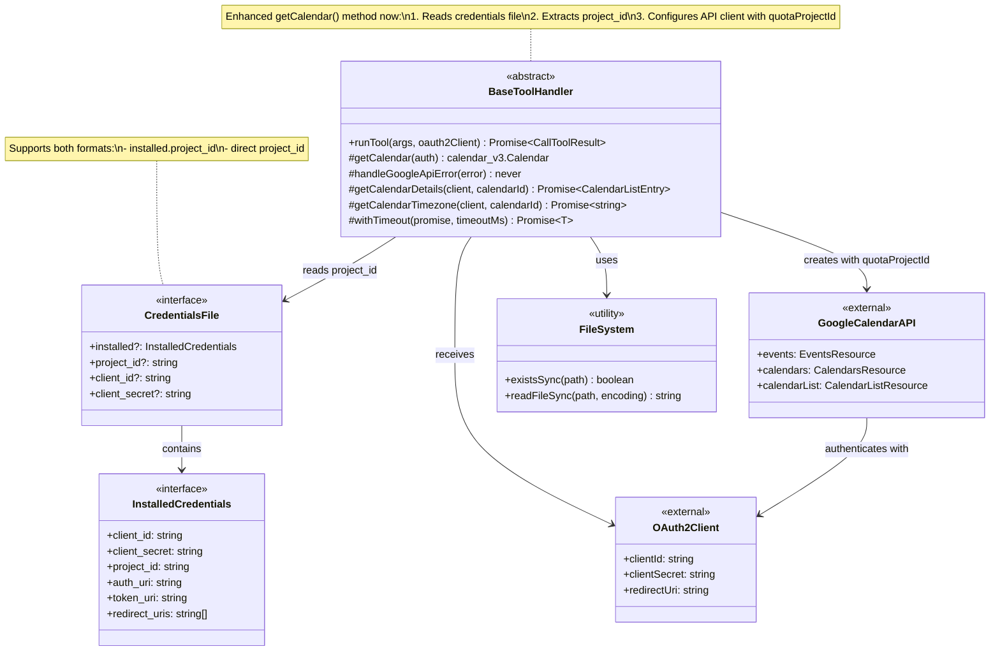
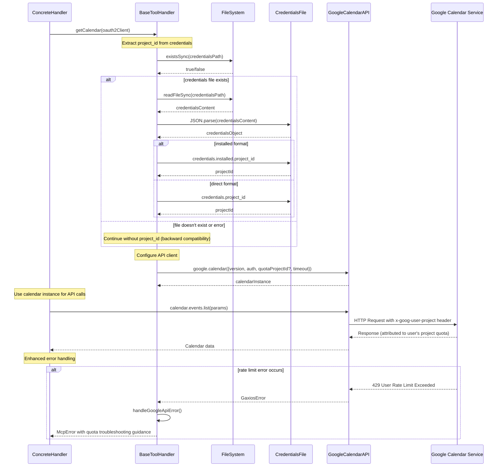

# Quota Project Fix - Architecture Documentation

This document provides UML diagrams and architectural details for the quota project header fix implemented in PR #90.

## Problem Statement

OAuth users were experiencing "User Rate Limit Exceeded" errors because Google Calendar API calls weren't including proper quota project headers (`x-goog-user-project`). This caused API requests to be attributed to shared quota pools instead of the user's Google Cloud Project quota.

## Solution Architecture

### Static Structure Diagram



### Object Interaction Diagram



## Key Components

### 1. BaseToolHandler Enhancement

The core fix is in the `getCalendar()` method:

```typescript
protected getCalendar(auth: OAuth2Client): calendar_v3.Calendar {
    // Try to get project ID from credentials file for quota project header
    let quotaProjectId: string | undefined;
    
    try {
        // Read credentials file to extract project ID
        const fs = require('fs');
        const path = require('path');
        
        // Get credentials file path (same logic as in auth/utils.ts)
        const credentialsPath = process.env.GOOGLE_OAUTH_CREDENTIALS || 
                              path.join(process.cwd(), 'gcp-oauth.keys.json');
        
        if (fs.existsSync(credentialsPath)) {
            const credentialsContent = fs.readFileSync(credentialsPath, 'utf-8');
            const credentials = JSON.parse(credentialsContent);
            
            // Extract project_id from installed format or direct format
            if (credentials.installed?.project_id) {
                quotaProjectId = credentials.installed.project_id;
            } else if (credentials.project_id) {
                quotaProjectId = credentials.project_id;
            }
        }
    } catch (error) {
        // If we can't read project ID, continue without it (backward compatibility)
    }

    const config: any = { 
        version: 'v3', 
        auth,
        timeout: 3000 // 3 second timeout for API calls
    };
    
    // Add quota project ID if available
    if (quotaProjectId) {
        config.quotaProjectId = quotaProjectId;
    }
    
    return google.calendar(config);
}
```

### 2. Credential File Formats Supported

**Installed Format (Standard Google Cloud Console download):**
```json
{
  "installed": {
    "client_id": "123456789.apps.googleusercontent.com",
    "client_secret": "GOCSPX-...",
    "project_id": "my-project-123",
    "auth_uri": "https://accounts.google.com/o/oauth2/auth",
    "token_uri": "https://oauth2.googleapis.com/token",
    "redirect_uris": ["http://localhost:3000/oauth2callback"]
  }
}
```

**Direct Format (Simplified):**
```json
{
  "client_id": "123456789.apps.googleusercontent.com",
  "client_secret": "GOCSPX-...",
  "project_id": "my-project-123",
  "redirect_uris": ["http://localhost:3000/oauth2callback"]
}
```

### 3. Enhanced Error Handling

When rate limit errors occur, the system now provides specific guidance:

```typescript
if (status === 429) {
    const errorMessage = errorData?.error?.message || '';
    
    // Provide specific guidance for quota-related rate limits
    if (errorMessage.includes('User Rate Limit Exceeded')) {
        throw new McpError(
            ErrorCode.InvalidRequest,
            `Rate limit exceeded. This may be due to missing quota project configuration.

Ensure your OAuth credentials include project_id information:
1. Check that your gcp-oauth.keys.json file contains project_id
2. Re-download credentials from Google Cloud Console if needed
3. The file should have format: {"installed": {"project_id": "your-project-id", ...}}

Original error: ${errorMessage}`
        );
    }
    // ... rest of error handling
}
```

## Benefits

1. **Automatic Project Attribution**: API requests are now properly attributed to the user's Google Cloud Project
2. **Backward Compatibility**: Works gracefully when project_id is missing
3. **Clear Error Guidance**: Users get specific troubleshooting steps when quota issues occur
4. **Minimal Code Changes**: Only ~30 lines of code changed in one core file
5. **Zero Configuration**: Automatically detects and uses project_id when available

## Impact

This fix resolves the "User Rate Limit Exceeded" errors for OAuth users by ensuring that Google Calendar API requests include the proper `x-goog-user-project` header, which correctly attributes API usage to the user's Google Cloud Project quota instead of shared quota pools.